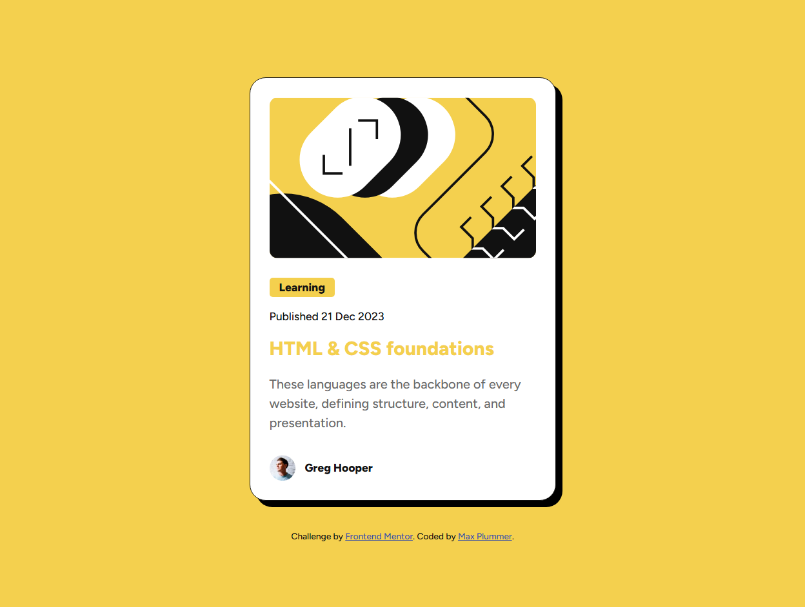

# Frontend Mentor - Blog preview card solution

This is a solution to the [Blog preview card challenge on Frontend Mentor](https://www.frontendmentor.io/challenges/blog-preview-card-ckPaj01IcS).

## Table of contents

- [Overview](#overview)
  - [The challenge](#the-challenge)
  - [Screenshot](#screenshot)
  - [Links](#links)
- [My process](#my-process)
  - [Built with](#built-with)
  - [What I learned](#what-i-learned)
  - [Useful resources](#useful-resources)
  - [AI Collaboration](#ai-collaboration)
- [Author](#author)

## Overview

### The challenge

Users should be able to:

- See hover and focus states for all interactive elements on the page

### Screenshot



### Links

- Solution URL: https://github.com/MaxPlummer/blog-preview-card

## My process

### Built with

- Semantic HTML5 markup
- CSS custom properties
- Flexbox
- Mobile-first workflow

### What I learned

I gained more experience with creating and using CSS classes for better code and designs. I learned more about using proper semantics by implementing more intuitive and appropriate HTML tags for a comprehensive webpage. 

```html
<article class="card">
  <figure class="illustration-wrapper">
```
I also learned about creating a responsive design with the @media rule to define different CSS behaviors for different screen sizes. I am aware of other practices for responsiveness, but the @media rule is an important tool that works well for this project. 
```css
@media (min-width: 550px) {
```

### Useful resources

- [W3Schools CSS @media Rule](https://www.w3schools.com/cssref/atrule_media.php) - I refer to the W3Schools website for refreshers on tags and rules as needed. The page on the @media rule was particularly helpful in explaining and demonstrating a way to make a responsive page design. 

### AI Collaboration

For this project, I used GitHub Copilot mainly as a consultant. I mostly asked the agent to explain the functionality of certains attributes and rules. I also used it for debugging by asking for suggestions as to the cause of certain issues such as why an image was clipping through its container. Overall, I would describe the AI as an educational tool.

- Tools used: *GitHub Copilot*
- How did you use them: Debugging, brainstorming solutions, explanations


## Author

- Website - [Max Plummer](https://github.com/MaxPlummer)
